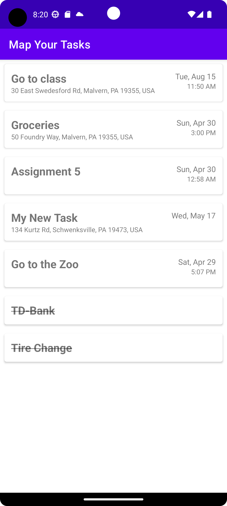
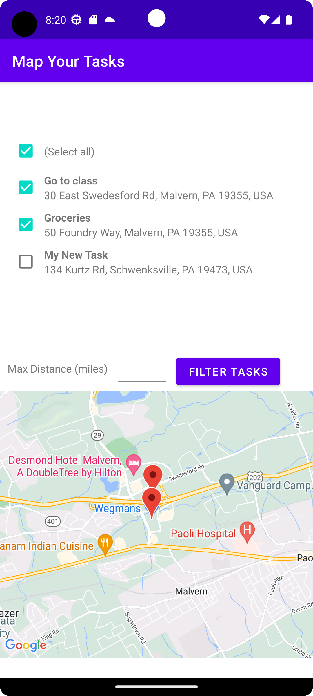

# Map Your Tasks

Humans are busy and forgetful. 
They need constant reminders of what needs to be done that are relevant to the tasks at hand. 
This applications mission is to unleash the productivity of humans by giving them a place to keep all their important tasks and reminding them when they need to be done. 
Through an easy to use Android application we allow users to make todo items that have a specific time or place they need to be done, along with notifications it is impossible to miss a deadline.

## Features

- Add/Update/Delete Tasks
- View tasks on a map
- Filter tasks based on distance from current location
- Notifications when tasks are occurring

## Screenshots

## Requirements

Android API 28-33

## Installation

This project uses [Android Studio](https://developer.android.com/studio) for development.

1. Install Android Studio
2. Clone Repository
3. Add `MAPS_API_KEY` to the `local.properties` file, using an API key generated from [Google Cloud Console](https://console.cloud.google.com).
4. Find and add your SHA-1 key to Firebase by following [these directions](https://developers.google.com/android/guides/client-auth). You may need to contact an author to add it to Firebase.

## Authors

- Bailey Myers
- Keyur Patel
- Ben Shaner
